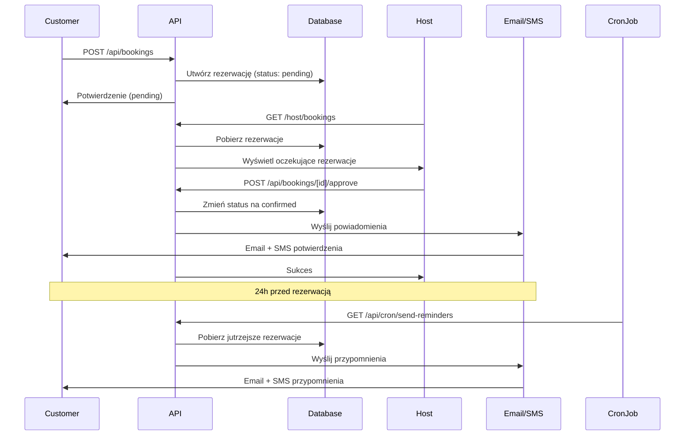

# System Zatwierdzania Rezerwacji (Booking Approval System)

## Przegląd

System zatwierdzania rezerwacji umożliwia właścicielom obiektów (hostom) zatwierdzanie lub odrzucanie rezerwacji dokonanych przez użytkowników. Po zatwierdzeniu rezerwacji, klient otrzymuje powiadomienia email oraz SMS (jeśli podał numer telefonu).

## Funkcjonalności

### 1. Status Rezerwacji

Rezerwacje mają następujące statusy:
- **pending** - Rezerwacja oczekuje na zatwierdzenie przez właściciela
- **confirmed** - Rezerwacja zatwierdzona przez właściciela
- **cancelled** - Rezerwacja odrzucona lub anulowana

### 2. Proces Rezerwacji

1. **Klient dokonuje rezerwacji** (`/api/bookings`)
   - Rezerwacja jest tworzona ze statusem `pending`
   - Klient widzi komunikat "Rezerwacja oczekuje na zatwierdzenie"

2. **Host otrzymuje powiadomienie**
   - Rezerwacja pojawia się na stronie `/host/bookings`
   - Oczekujące rezerwacje są wyróżnione w osobnej sekcji

3. **Host zatwierdza lub odrzuca rezerwację**
   - Zatwierdzenie: `/api/bookings/[bookingId]/approve`
   - Odrzucenie: `/api/bookings/[bookingId]/reject`

4. **Klient otrzymuje powiadomienia**
   - Email zawsze wysyłany
   - SMS wysyłany jeśli podano numer telefonu
   - Przypomnienie przed rezerwacją (24h wcześniej)

## Struktura Plików

### API Endpoints

```
app/api/bookings/
├── route.ts                          # POST - Tworzenie rezerwacji (status: pending)
└── [bookingId]/
    ├── approve/
    │   └── route.ts                  # POST - Zatwierdzenie rezerwacji
    └── reject/
        └── route.ts                  # POST - Odrzucenie rezerwacji

app/api/cron/
└── send-reminders/
    └── route.ts                      # GET - Wysyłanie przypomnień (cron job)
```

### Komponenty

```
components/
└── booking-approval-actions.tsx      # Przyciski zatwierdzania/odrzucania
└── booking-widget.tsx                # Widget rezerwacji (zaktualizowany)
```

### Biblioteki

```
lib/notifications/
├── email.ts                          # Funkcje wysyłania email
├── sms.ts                            # Funkcje wysyłania SMS
└── reminder-scheduler.ts             # Scheduler przypomnień
```

### Strony

```
app/host/bookings/
└── page.tsx                          # Strona zarządzania rezerwacjami
```

## Powiadomienia

### Email

Biblioteka `lib/notifications/email.ts` zawiera funkcje do wysyłania emaili:
- `sendBookingConfirmationEmail()` - Potwierdzenie zatwierdzonej rezerwacji
- `sendBookingReminderEmail()` - Przypomnienie przed rezerwacją

**Uwaga:** Obecnie implementacja loguje emaile do konsoli. Aby wysyłać prawdziwe emaile, należy zintegrować z dostawcą:
- Resend (zalecane dla Next.js)
- SendGrid
- AWS SES
- Nodemailer z SMTP

### SMS

Biblioteka `lib/notifications/sms.ts` zawiera funkcje do wysyłania SMS:
- `sendBookingConfirmationSMS()` - Potwierdzenie zatwierdzonej rezerwacji
- `sendBookingReminderSMS()` - Przypomnienie przed rezerwacją

**Uwaga:** Obecnie implementacja loguje SMS do konsoli. Aby wysyłać prawdziwe SMS, należy zintegrować z dostawcą:
- Twilio (zalecane)
- SMSApi.pl (dla Polski)
- AWS SNS
- Vonage

## Konfiguracja

### 1. Zmienne Środowiskowe

Dodaj do `.env.local`:

```env
# Email Service (przykład z Resend)
RESEND_API_KEY=re_xxxxxxxxxxxxx

# SMS Service (przykład z Twilio)
TWILIO_ACCOUNT_SID=ACxxxxxxxxxxxxx
TWILIO_AUTH_TOKEN=xxxxxxxxxxxxx
TWILIO_PHONE_NUMBER=+1234567890

# Cron Job Security
CRON_SECRET=your-secret-token-here
```

### 2. Integracja Email (Resend)

```bash
npm install resend
```

Zaktualizuj `lib/notifications/email.ts`:

```typescript
import { Resend } from 'resend'

const resend = new Resend(process.env.RESEND_API_KEY)

export async function sendEmail(options: EmailOptions) {
  try {
    await resend.emails.send({
      from: 'EnjoyHub <notifications@enjoyhub.com>',
      to: options.to,
      subject: options.subject,
      html: options.html,
    })
    return { success: true }
  } catch (error) {
    console.error("Error sending email:", error)
    return { success: false, error: String(error) }
  }
}
```

### 3. Integracja SMS (Twilio)

```bash
npm install twilio
```

Zaktualizuj `lib/notifications/sms.ts`:

```typescript
import twilio from 'twilio'

const client = twilio(
  process.env.TWILIO_ACCOUNT_SID,
  process.env.TWILIO_AUTH_TOKEN
)

export async function sendSMS(phone: string, message: string) {
  try {
    await client.messages.create({
      body: message,
      from: process.env.TWILIO_PHONE_NUMBER,
      to: phone
    })
    return { success: true }
  } catch (error) {
    console.error("Error sending SMS:", error)
    return { success: false, error: String(error) }
  }
}
```

## Przypomnienia

### Konfiguracja Cron Job

Aby automatycznie wysyłać przypomnienia 24h przed rezerwacją, skonfiguruj cron job.

#### Opcja 1: Vercel Cron

Utwórz plik `vercel.json` w głównym katalogu:

```json
{
  "crons": [{
    "path": "/api/cron/send-reminders",
    "schedule": "0 10 * * *"
  }]
}
```

To uruchomi endpoint codziennie o 10:00 UTC.

#### Opcja 2: GitHub Actions

Utwórz `.github/workflows/send-reminders.yml`:

```yaml
name: Send Booking Reminders

on:
  schedule:
    - cron: '0 10 * * *'  # Codziennie o 10:00 UTC
  workflow_dispatch:      # Ręczne uruchomienie

jobs:
  send-reminders:
    runs-on: ubuntu-latest
    steps:
      - name: Send reminders
        run: |
          curl -X GET \
            -H "Authorization: Bearer ${{ secrets.CRON_SECRET }}" \
            https://twoja-domena.com/api/cron/send-reminders
```

#### Opcja 3: Zewnętrzny Cron Service

Użyj serwisu takiego jak:
- cron-job.org
- EasyCron
- AWS CloudWatch Events

Skonfiguruj wywołanie GET do:
```
https://twoja-domena.com/api/cron/send-reminders
```

Z nagłówkiem:
```
Authorization: Bearer your-secret-token
```

## Testowanie

### 1. Test Tworzenia Rezerwacji

```bash
curl -X POST http://localhost:3000/api/bookings \
  -H "Content-Type: application/json" \
  -d '{
    "offerId": "offer-id",
    "date": "2024-12-20",
    "startTime": "14:00",
    "persons": 2,
    "customerName": "Jan Kowalski",
    "customerEmail": "jan@example.com",
    "customerPhone": "+48123456789"
  }'
```

### 2. Test Zatwierdzania Rezerwacji

```bash
curl -X POST http://localhost:3000/api/bookings/[booking-id]/approve \
  -H "Cookie: [session-cookie]"
```

### 3. Test Odrzucania Rezerwacji

```bash
curl -X POST http://localhost:3000/api/bookings/[booking-id]/reject \
  -H "Cookie: [session-cookie]"
```

### 4. Test Przypomnień

```bash
curl -X GET http://localhost:3000/api/cron/send-reminders \
  -H "Authorization: Bearer your-secret-token"
```

## Przepływ Danych



## Bezpieczeństwo

1. **Autoryzacja**: Tylko właściciel obiektu może zatwierdzać/odrzucać rezerwacje
2. **Walidacja**: Wszystkie dane wejściowe są walidowane
3. **Cron Security**: Endpoint `/api/cron/send-reminders` wymaga tokena autoryzacji
4. **Rate Limiting**: Rozważ dodanie rate limitingu dla endpoints

## Przyszłe Usprawnienia

1. **Panel administracyjny** dla rezerwacji
2. **Historia akcji** (kto, kiedy zatwierdził/odrzucił)
3. **Powiadomienia push** dla aplikacji mobilnej
4. **Automatyczne przypomnienia** w różnych odstępach czasu (3 dni, 1 dzień, 1 godzinę)
5. **Szablony wiadomości** z możliwością personalizacji
6. **Statystyki** dotyczące rezerwacji i zatwierdzeń
7. **Integracja z kalendarzem** (Google Calendar, iCal)

## Wsparcie

W przypadku pytań lub problemów:
1. Sprawdź logi konsoli dla szczegółów błędów
2. Zweryfikuj konfigurację zmiennych środowiskowych
3. Upewnij się, że użytkownik ma odpowiednie uprawnienia
4. Sprawdź status rezerwacji w bazie danych
